# Hi there, I'm Likhith Reddy Sirigireddy! 👋

<div align="center">
  
[](https://git.io/typing-svg)

</div>

---

## 🚀 About Me

> **"Building the next big thing in AI. Solo or small-team focused."**

I'm a passionate **AI/ML Engineer** and **Full-Stack Developer** with a vision to create impactful solutions that reach millions. Currently focused on mastering the art of building scalable AI-first products while maintaining a strong foundation in full-stack development.

## 🔭 Currently Working On

- 🌐 **CampusConnect** - A comprehensive full-stack web application
- 🏗️ Learning **system design** and **microservices architecture**
- 🧠 Deep diving into **advanced AI topics** and **machine learning**
- 💡 Building **AI-first products** with real-world impact

## 🌱 Currently Learning

```python
learning_path = {
    "core_skills": ["Python", "Data Structures & Algorithms", "Competitive Programming"],
    "ai_ml": ["Machine Learning", "Deep Learning", "Neural Networks"],
    "system_design": ["Microservices", "Scalable Systems", "Optimization"],
    "projects": ["Full-stack AI Applications", "Open-source Contributions"]
}
```

## 🛠️ Tech Stack

### **Languages**


### **Frontend**


### **Backend**


### **Databases**


### **Cloud & Tools**


### **AI/ML**


## 🧠 My AI/ML Journey

```mermaid
graph TD
    A[🎯 Goal: AI/ML Mastery] --> B[📚 Learning Fundamentals]
    B --> C[🔨 Building Projects]
    C --> D[🚀 Real-world Applications]
    D --> E[🌟 Impactful Solutions]
    
    B --> B1[Python & DSA]
    B --> B2[ML Algorithms]
    B --> B3[Deep Learning]
    
    C --> C1[CampusConnect]
    C --> C2[AI Projects]
    C --> C3[Open Source]
    
    E --> E1[Top-tier Companies]
    E --> E2[AI-first Products]
    E --> E3[Global Impact]
```



## 💪 Core Strengths

- 🚀 **Fast Learner** - Quickly adapts to new technologies and concepts
- 🎯 **Focused** - Laser-focused on achieving goals with precision
- 🧠 **Practical Thinker** - Converts complex ideas into actionable solutions
- ⚡ **Optimization Enthusiast** - Passionate about building scalable systems
- 🎨 **Clean Code Advocate** - Obsessed with writing maintainable, elegant code

## 🎯 Future Goals

- 🏆 **Crack top-tier product companies** (FAANG+)
- 🤝 **Contribute to open-source AI tools** and frameworks
- 🌍 **Build AI-first products** that positively impact millions of users
- 📚 **Share knowledge** through technical blogs and community contributions

## 📊 GitHub Stats

<div align="center">
  
[](https://github.com/anuraghazra/github-readme-stats)

[](https://git.io/streak-stats)

[](https://github.com/anuraghazra/github-readme-stats)

</div>

## 🏆 GitHub Trophies

<div align="center">
  
[](https://github.com/ryo-ma/github-profile-trophy)

</div>

## 📈 Contribution Activity

[](https://github.com/ashutosh00710/github-readme-activity-graph)

## ⚡ Fun Facts

- 🎨 **UI/UX Perfectionist** - I believe great products start with intuitive interfaces
- 🧩 **Mental Model Builder** - Love breaking down complex concepts into simple, digestible frameworks
- 🌟 **Inspiration Sources** - Motivated by Elon Musk's innovation, Andrew Ng's teaching, and the open-source community's collaboration
- 🔍 **Problem Solver** - Always looking for the elegant solution to complex challenges
- 📱 **Tech Enthusiast** - Stay updated with the latest in AI, web development, and emerging technologies

## 🎵 Coding Soundtrack

[](https://open.spotify.com/user/YOUR_SPOTIFY_USERNAME)

## 📫 Let's Connect!

<div align="center">

[](https://linkedin.com/in/YOUR_LINKEDIN)
[](https://twitter.com/YOUR_TWITTER)
[](https://your-portfolio.com)
[](mailto:your.email@gmail.com)

</div>

---

<div align="center">
  
### 💡 "The best way to predict the future is to create it" - Peter Drucker

**⭐ Star my repositories if you find them interesting!**


</div>

---

<div align="center">
  
</div>
